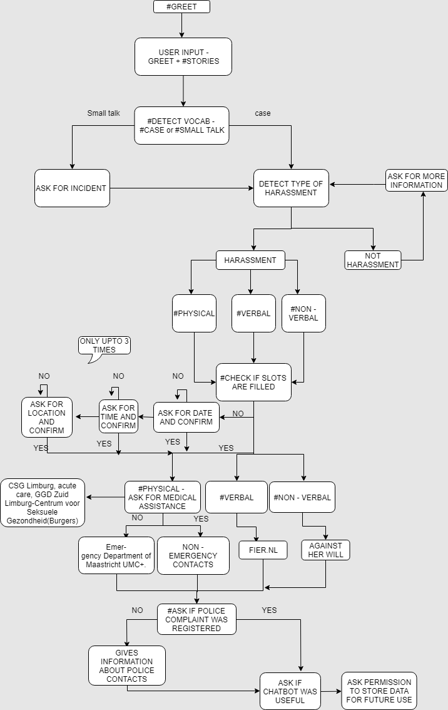

# About

In this project we try to leverage natural language procesing to help victims of sexual harrasment in the city of Maastricht. This project is a part of my master course work and was done along with 4 other students and professor as our guide. We aim to create a medium through which people could share their misfortunate events in a non judgemental environment. The idea is to create a chatbot that can understand user input related to the event and classify what type of event the user underwent and reply with appropriate information. The bot will not be self contained meaning it can only understand certain thing related to events since the training data was limited.

## Data

The training data for positive class was accquired from [here](https://www.safecity.in/). For negative class, random text from around the internet that does not relate to out problem was used. 

## Training

The pipeline has two different classifications, one for identifying if the input is a case or not which is done by a SVM classifier. The second classifier makes uses of deep learning, specifically BERT architecture which is hosted on top of a chatbot layer. For the original implementation the chatbot was written using the telegram API.
The structure for the dialog is shown in the image below. 

## Edit

Happy to say the team won the best paper award in ECMLPKDD data science [workshop](https://sites.google.com/view/ecmlpkddsogood2019/awards?authuser=0).
The chatbot is also being hosted and can be used with this [link](https://safe-maastricht.ddns.net/#/chat).
